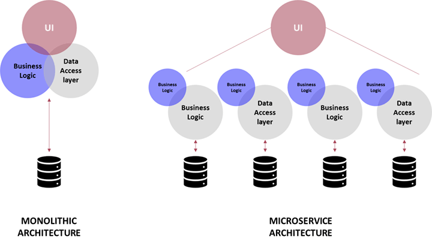
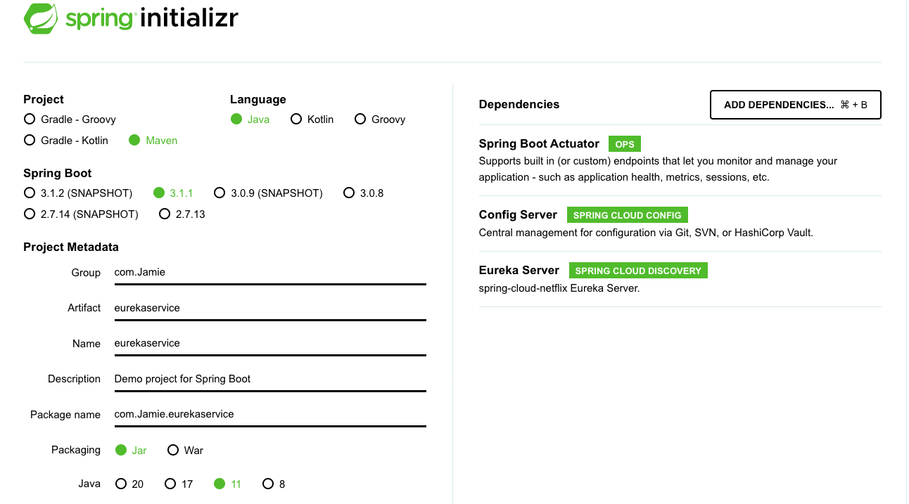

# Java-Microservices

## Monolith architecture
- Simpler development and deployment for smaller teams and applications.
- Fewer cross-cutting concerns.
- Better performance due to no netowrk latency. 

However:
- Difficult to adpot new technologies.
- Limited agility.
- Single code base and difficult to maintane.
- Not fault tolerant.

## Service-Oriented-architecture (SOA)
- Reusability of services
- Better maintainability
- Higher reliability
- Parallel development

However:
- Extra overload
- High investment costs
- Extra overload

## Microservices architecture 
- Easy to develop, test and deploy
- Increased agility
- Ability to scale horizontally
- Parallel development

However:
- Complexity
- Infastructure overhead
- Security concerns 

# Spring
It's a framework and architectural style that enables the development of microservices-based applications using the spring framework. 

- Scalability: You can scale microservices individually based on their specific resource requirements.
- Loose coupling: Each microservice can be developed, deployed and scaled independantly without affecting the others.
- Fault isolation: If one microservice fails, it doesn't necessarily affect the entire system. 
- Easy integration: The integration process is made simpler using Spring Cloud. 

# Creating a project
### Spring
- Within spring, a project can be started using Java.
- The relevant name and dependancies can then be selected.

### Eclipse
- In the app Eclipse, we can load in the project built in with spring.
- In my case, I built `hello-world`.
- Within the folder `helloworldservice` I can add a new class called `helloworldRestController`. These folder can be found at https://github.com/eazybytes/microservices-with-spring-sectionwise-code/tree/master/section2/helloworldservice.
- Here, we can the run the folder as a Java application, and it should work on `http://localhost:8080`.
- We can also add additional enpoints if we want. 

## Containerisation
It's a method of deploying and running applications in a portable and isolated manner. It involves packaging an application along with its dependancies and libaries into a self-contained unit called a container. Containers offer benefits like scalability, faster deployment and improved resource utilisation. 

A container is a loosly isolated environment that allows us to build and run software packages. These software packages include the code and all dependancies to run applications quickly and reliably on any computing environment. They're called images. 

Docker is one of the tools that used the idea of isolated resource to create a set of tools that allows applications to be packaged with all the dependancies installed and ran wherever wanted.

## Using Docker
- We can create a `Dockerfile` where we install Java dependancies, add the applications jar to the container (whatever app we built with Spring), and execute the application. 
- We can then build the Dockerfile. 
- Using `docker run -p 8080:8080 <name>` we can then launch the app.
- We can also launch on a different port at the same time using `docker run -p 8081:8080 <name>` 
- We can do this for whatever microservices we want. 
- These images can then be pushed to Dockerhub in the normal way. 
- If we want to launch and manage microservices together, we can use the Docker-compose technique. 
- Note: The Buildpacks app can help us to create images without creating a Dockerfile. 

# Spring cloud config
It allows for centralised configuration management for distributed systems. It allows you to store and manage application configuration files in a Git repository or other storage backends. You can achieve configuration consistency, versioning and manageability across multiple services or microservices in a distributed system. 

Microservice configuration management is defined as the process of tracking changes to microservices and their consuming applications over time. 

In microservices, you have multiple applications and multiple instances to configure and manage. During microservices configuration, it’s essential to have the ability to track and manage the version history of configuration changes. There’s a difference between having real-time management and having changes happen in real time. Knowing the differences between the two updates is critical to determining root cause analysis. These changes are a starting point for understanding the problem. 

# Service discovery
Service discovery and registration deals with the problems about how microservices talk to each other (perform API calls).

In a modern microservice architecture, knowing the right network location of an application is a much more complex problem for the clients as service instances might have dynamically assigned IP addresses. The number may also change due to failure and autoscaling. 

## Why not traditional load balancing?
- Limited horizontal scalability and licenses costs
- Single point of failure 
- Manually managed to update any IP's configurations.
- Not container friendly
- Complex in nature

## How service discovery works

- Service discovery tools are developed to overcome the challenges with traditional load balancers.
- Mainly it consists of a key-value store (Service Registry) and an API to read from and write to the store. New instances of applications are saved to this registry and deleted when the service is down or not healthy. 
- Advantages are:
    - No limitations on availability
    - Peer to peer communication between service discovery agents
    - Dynamically managed IP's, configurations and load balanced 
    - Fault-tolerant and resiliant in nature

## Spring cloud support
- Spring cloud Netflix Eureka service acts as a service discovery agent.
- Spring cloud Load balancer libary for client-side load balancing.
- Netflix Feign client to look up a service between microservices. 

## Setting it up
### Spring boot
- Use the following setup. 
